# Design Document: Production-Ready Enterprise Enhancement for Bride Bien

## Overview

This design document outlines the comprehensive transformation of Bride Bien from a luxury bridal fashion prototype into a production-ready, enterprise-grade e-commerce platform. The enhancement preserves the existing luxury aesthetic and 3D/AR capabilities while adding critical enterprise features including backend infrastructure, e-commerce functionality, CMS, security, monitoring, and scalability.

The system will support high-traffic luxury e-commerce operations with real-time AR experiences, secure payment processing, multi-language support, and enterprise-grade reliability. The architecture follows modern cloud-native patterns with microservices, API-first design, and progressive enhancement principles.

**Key Objectives:**
- Transform prototype into production-ready application
- Maintain luxury brand identity and user experience
- Add complete e-commerce and appointment booking functionality
- Implement enterprise security and monitoring
- Achieve 99.9% uptime SLA and <3s page load times
- Support 10,000+ concurrent users
- Ensure WCAG 2.1 AA accessibility compliance

## Architecture

### System Architecture Overview

```mermaid
graph TB
    subgraph "Client Layer"
        WEB[Web Application<br/>React 19 + Vite]
        PWA[Progressive Web App<br/>Service Worker]
    end
    
    subgraph "CDN & Edge"
        CDN[CloudFlare CDN<br/>Static Assets]
        EDGE[Edge Functions<br/>Image Optimization]
    end
    
    subgraph "API Gateway"
        GATEWAY[API Gateway<br/>Rate Limiting + Auth]
    end
    
    subgraph "Application Services"
        AUTH[Auth Service<br/>JWT + OAuth]
        PRODUCT[Product Service<br/>Catalog Management]
        ORDER[Order Service<br/>E-commerce Logic]
        APPT[Appointment Service<br/>Booking System]
        USER[User Service<br/>Profile Management]
        CMS[CMS Service<br/>Content Management]
        MEDIA[Media Service<br/>3D/AR Assets]
        NOTIFY[Notification Service<br/>Email/SMS]
    end
    
    subgraph "Payment Gateway"
        STRIPE[Stripe API]
        PAYPAL[PayPal API]
    end
    
    subgraph "Data Layer"
        POSTGRES[(PostgreSQL<br/>Relational Data)]
        REDIS[(Redis<br/>Cache + Sessions)]
        S3[(S3/R2<br/>Media Storage)]
        SEARCH[(Elasticsearch<br/>Product Search)]
    end
    
    subgraph "Monitoring & Analytics"
        SENTRY[Sentry<br/>Error Tracking]
        GA[Google Analytics 4]
        DATADOG[DataDog<br/>APM + Logs]
    end
    
    WEB --> CDN
    WEB --> PWA
    CDN --> EDGE
    WEB --> GATEWAY
    
    GATEWAY --> AUTH
    GATEWAY --> PRODUCT
    GATEWAY --> ORDER
    GATEWAY --> APPT
    GATEWAY --> USER
    GATEWAY --> CMS
    GATEWAY --> MEDIA
    GATEWAY --> NOTIFY
    
    ORDER --> STRIPE
    ORDER --> PAYPAL
    
    AUTH --> POSTGRES
    PRODUCT --> POSTGRES
    ORDER --> POSTGRES
    APPT --> POSTGRES
    USER --> POSTGRES
    CMS --> POSTGRES
    
    PRODUCT --> REDIS
    USER --> REDIS
    AUTH --> REDIS
    
    MEDIA --> S3
    CMS --> S3
    
    PRODUCT --> SEARCH
    
    WEB --> SENTRY
    WEB --> GA
    GATEWAY --> DATADOG
    PRODUCT --> DATADOG
    ORDER --> DATADOG
```



### Technology Stack

**Frontend:**
- React 19.2.5 (existing)
- TypeScript 5.x (migration from JavaScript)
- Vite 8.0.10 (existing)
- Tailwind CSS 4.2.4 (existing)
- Three.js 0.184.0 (existing)
- Framer Motion 12.38.0 (existing)
- React Router DOM 7.14.2 (existing)
- React Query (TanStack Query) - Server state management
- Zustand - Client state management
- React Hook Form - Form management
- Zod - Schema validation
- react-i18next - Internationalization

**Backend:**
- Node.js 20 LTS + Express.js OR Next.js 15 API Routes
- TypeScript 5.x
- Prisma ORM - Database access
- PostgreSQL 16 - Primary database
- Redis 7 - Caching and sessions
- Elasticsearch 8 - Product search

**Infrastructure:**
- Vercel/Netlify - Frontend hosting
- AWS/Railway/Render - Backend hosting
- CloudFlare - CDN and DDoS protection
- CloudFlare R2 or AWS S3 - Media storage
- CloudFlare Images - Image optimization

**Payment & Services:**
- Stripe - Payment processing
- PayPal - Alternative payment
- Twilio/SendGrid - SMS/Email notifications
- Google Calendar API - Appointment scheduling

**Monitoring & Analytics:**
- Sentry - Error tracking
- Google Analytics 4 - User analytics
- DataDog/New Relic - APM and logging
- Uptime Robot - Uptime monitoring

**CI/CD:**
- GitHub Actions - CI/CD pipeline
- Playwright - E2E testing
- Vitest - Unit testing
- Cypress - Component testing

## Sequence Diagrams

### User Authentication Flow

```mermaid
sequenceDiagram
    participant U as User
    participant W as Web App
    participant G as API Gateway
    participant A as Auth Service
    participant D as Database
    participant R as Redis
    
    U->>W: Click "Login"
    W->>W: Show login modal
    U->>W: Enter credentials
    W->>G: POST /api/auth/login
    G->>A: Forward request
    A->>D: Query user by email
    D-->>A: User data
    A->>A: Verify password hash
    A->>A: Generate JWT token
    A->>R: Store session
    R-->>A: Session stored
    A-->>G: Return JWT + user data
    G-->>W: 200 OK + token
    W->>W: Store token in localStorage
    W->>W: Update auth state
    W-->>U: Redirect to dashboard
